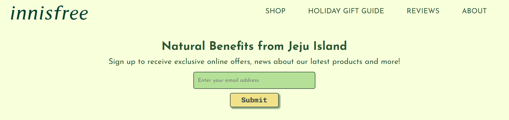
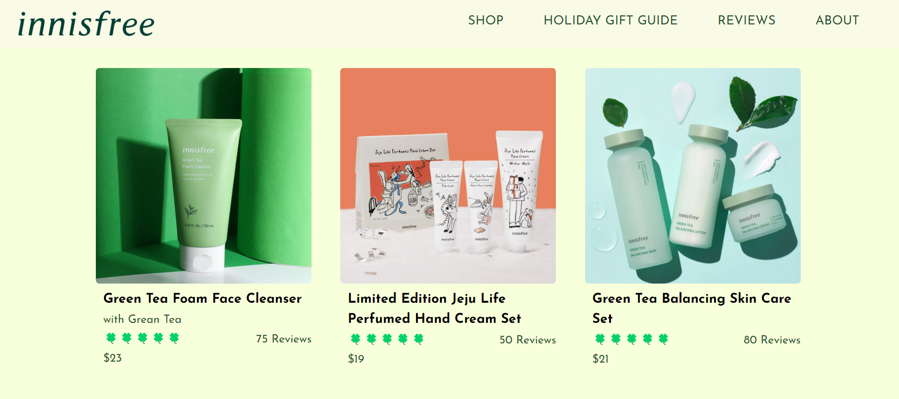
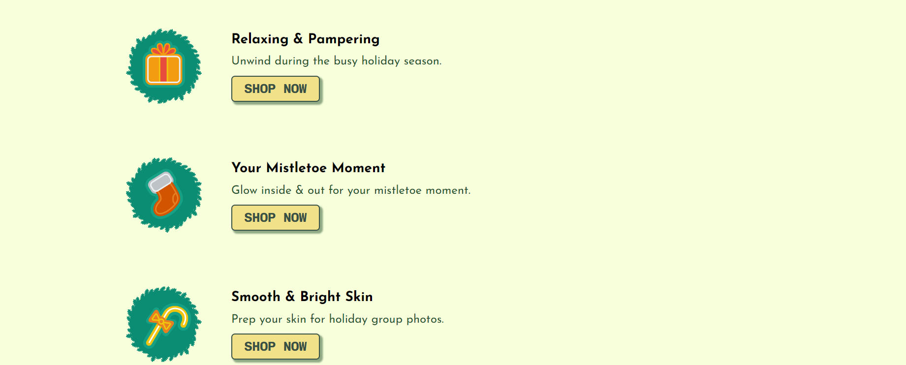
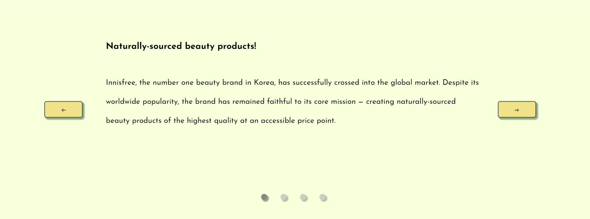
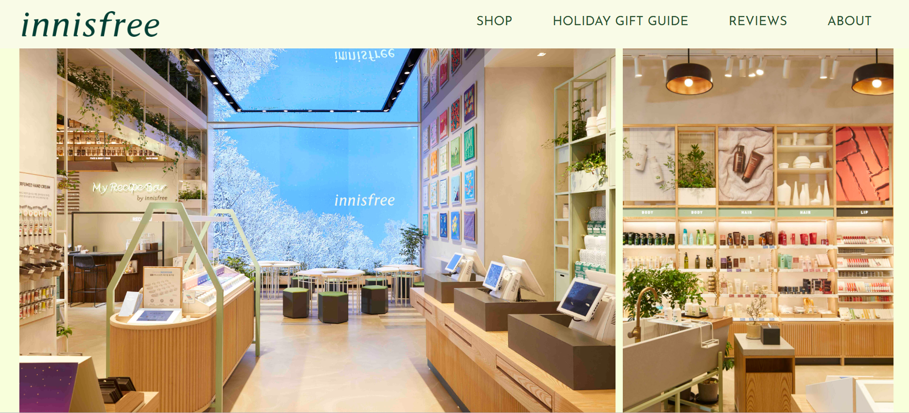

# Innisfree Landing Page

## Table of contents

- [Overview](#overview)
  - [Screenshot](#screenshot)
  - [Links](#links)
- [My process](#my-process)
  - [Built with](#built-with)
  - [What I learned](#what-i-learned)
  - [Continued development](#continued-development)

## Overview

This is a simple version of Innisfree, a South Korean cosmetics brand landing page.

### Screenshot

### Links

- Solution URL: [Solution URL here](https://github.com/NunuAbuashvili/Innisfree-Landing-Page.git)
- Live Site URL: [Live site URL here](https://nunuabuashvili.github.io/Innisfree-Landing-Page/)

## My process

### Built with

- Semantic HTML5 markup
- CSS custom properties
- Flexbox
- CSS Grid
- Mobile-first workflow
- JavaScript

### What I learned

I created this simple design while taking the Responsive Web Design course from FreeCodeCamp. At that time I had only a superficial understanding of JavaScript. Later I took the course "The Complete JavaScript Course: From Zero to Expert!" by brilliant Jonas Schmedtmann. After learning some of the most frequently used DOM manipulations, I decided to return to this project and implement my knowledge in order to make the page more interactive.

Features included:

- Email validation (Error messages both for an empty field and an incorrect format);
- Refresh the page (Page reload when the user clicks on the logo image);
- Smooth scrolling to the relevant section (User gets smooth scrolling when clicking on the navigation elements);
- Fade-in/fade-out navigation menu (When the user hovers mouse on one of the navigation elements, the rest of the navbar fades out);
- Sticky navigation menu (Using JavaScript);
- Slider component (Swipe user reviews by clicking on buttons, arrow keys or dots).

### Continued development

I would like to increase the scale of my future projects both in terms of content and functionality.
